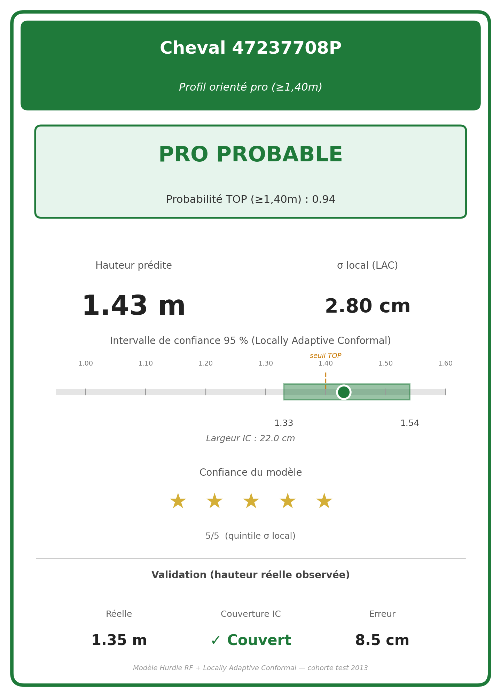
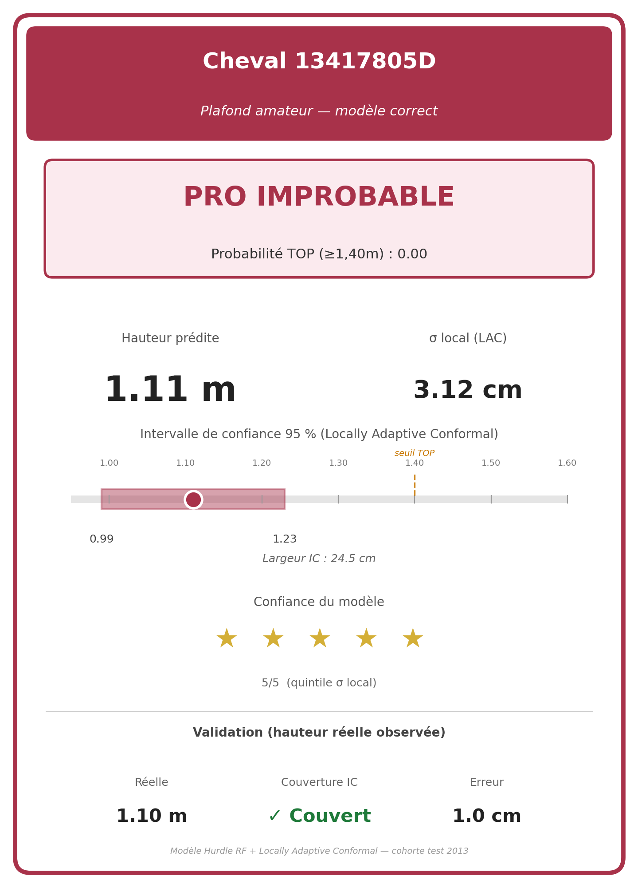
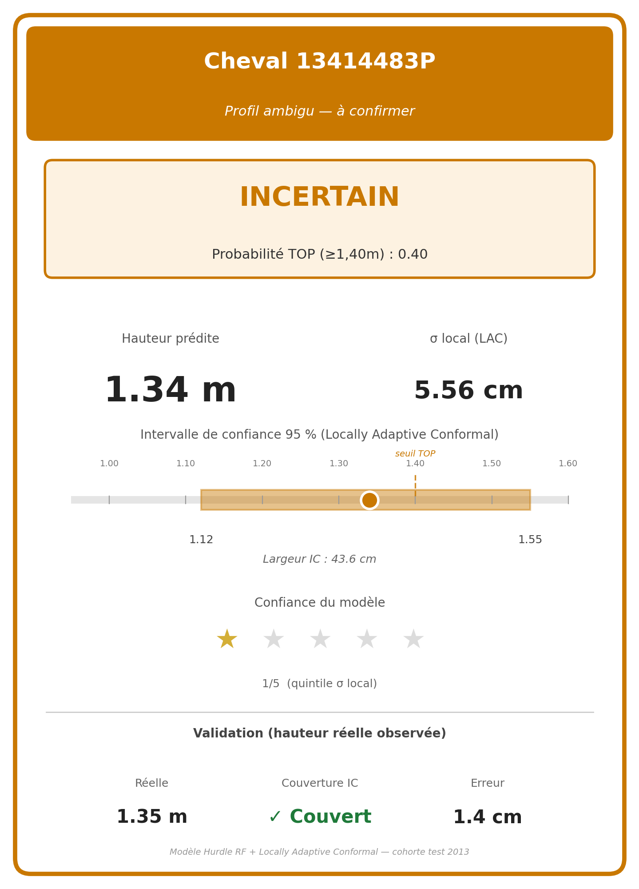
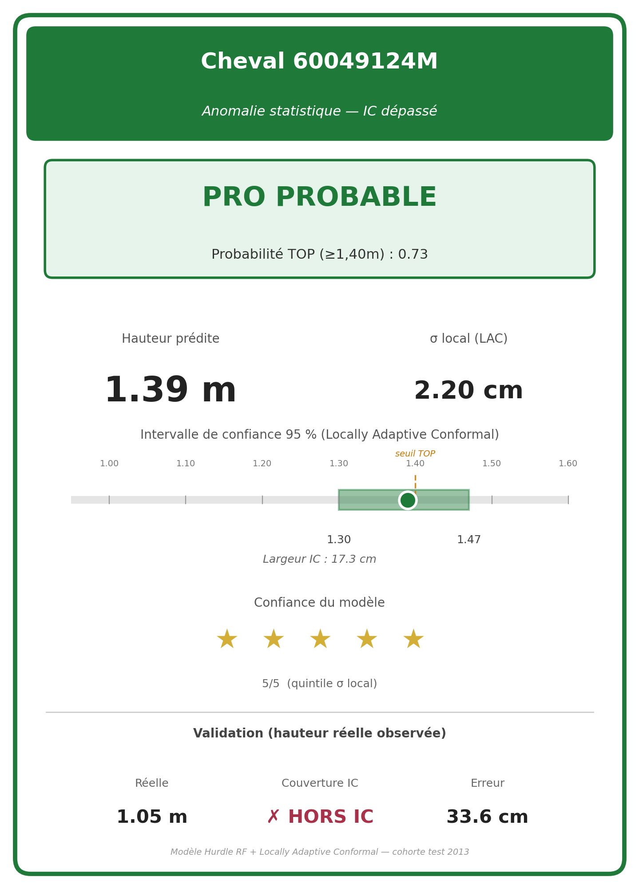
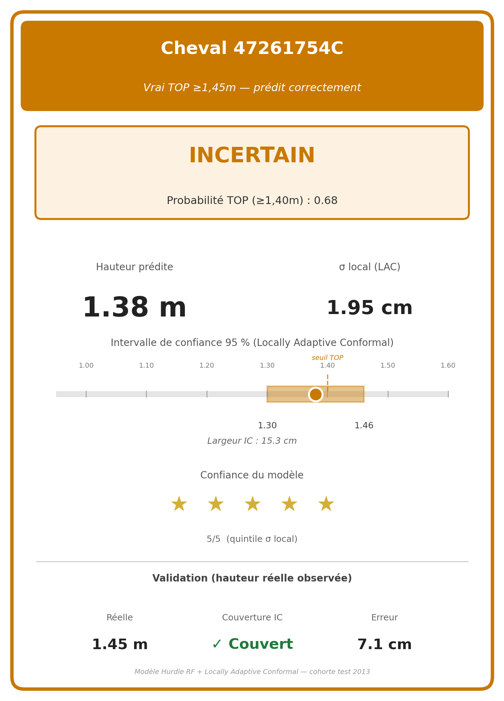

# Annexe B : Fiches de prédiction

Pour matérialiser la sortie opérationnelle du modèle, chaque cheval prédit donne lieu à une **fiche individuelle** qui agrège, sur une seule page, toutes les grandeurs nécessaires à une décision métier : statut probable, hauteur ponctuelle prédite, intervalle de confiance à 95 %, indicateur d'incertitude locale. Cette annexe documente l'anatomie d'une fiche, présente les cinq profils discutés en section 5 du rapport, et décrit l'application qui permet à un utilisateur final de générer la fiche d'un cheval à partir de son seul numéro SIRE.

---

## B.1 : Anatomie d'une fiche

Une fiche de prédiction est conçue pour être lue **sans connaissance préalable du modèle**. Elle est structurée en quatre blocs verticaux :

1. **Bandeau d'identification** (cadre coloré, en haut). Le code couleur reflète directement le statut prédit : vert pour *Pro probable* (P_top ≥ 0,70), rouge pour *Pro improbable* (P_top < 0,30), orange pour *Incertain*. Le bandeau rappelle aussi le numéro SIRE et le profil court.

2. **Bloc statut + probabilité TOP**. La probabilité que le cheval atteigne ≥ 1,40 m est issue du classifieur Random Forest balanced du modèle Hurdle. Le statut textuel est dérivé du seuillage à 0,30 / 0,70 documenté en section 3.5.

3. **Bloc prédiction quantitative**. Trois éléments :
   - La **hauteur ponctuelle prédite** ŷ_Hurdle = p · ŷ_tops + (1 − p) · ŷ_default.
   - Le **σ local (LAC)** : écart-type des prédictions entre les 500 arbres du Random Forest. C'est la grandeur statistique qui module l'IC adaptatif (section 4.2).
   - L'**intervalle de confiance à 95 %** : visualisé sous forme de barre horizontale graduée de 1,00 m à 1,60 m. Le seuil TOP (1,40 m) est matérialisé par un trait pointillé orange ; la largeur de l'IC est annotée en cm pour faciliter la comparaison entre chevaux.

4. **Bloc confiance + validation**. La confiance du modèle est codée en étoiles : 5 / 5 si σ local appartient au premier quintile de la distribution test (les 20 % des prédictions les plus certaines), 1 / 5 s'il appartient au dernier quintile. Lorsque la vraie hauteur réelle est connue (cohorte test), un bloc validation indique la couverture de l'IC et l'erreur ponctuelle en centimètres.

---

## B.2 : Cinq profils représentatifs

Les cinq fiches ci-dessous illustrent les cas types rencontrés en production. Elles correspondent aux profils analysés en section 5.4 du rapport et permettent de couvrir l'éventail des comportements du modèle, du succès net à l'anomalie statistique assumée.

### B.2.1 : Crack confirmé, modèle confiant et correct

{ width=70% }

**Cheval 47237708P** : P_top = 0,94, prédit 1,43 m, IC étroit de 22 cm, σ local de 2,80 cm (quintile 1 → 5 / 5 étoiles). La hauteur réelle observée à 1,35 m reste à l'intérieur de l'IC. C'est le cas nominal : le modèle exploite un signal fort (carrière déjà engagée sur des hauteurs élevées), produit une prédiction précise, et l'écart résiduel de 8,5 cm reflète l'incertitude irréductible.

### B.2.2 : Plafond amateur, modèle confiant et correct

{ width=70% }

**Cheval 13417805D** : P_top = 0,00, prédit 1,11 m, IC de 24,5 cm centré sur les hauteurs Club. La hauteur réelle de 1,10 m est quasi parfaitement prédite (erreur 1,0 cm). Le modèle identifie ici un profil amateur stabilisé et le contrôle sans ambiguïté. C'est le cas le plus fréquent en volume (~70 % de la cohorte) et celui qui valide l'utilité métier la plus immédiate : éviter les promesses de pro chez des chevaux qui ne le seront jamais.

### B.2.3 : Cas incertain, modèle peu confiant et honnête

{ width=70% }

**Cheval 13414483P** : P_top = 0,40, prédit 1,34 m, IC très large de 43,6 cm, σ local de 5,56 cm (quintile 5 → 1 / 5 étoile). La hauteur réelle de 1,35 m tombe au cœur de l'IC. Ce profil illustre la propriété la plus importante de la chaîne LAC : **quand le modèle ne sait pas, il le dit**. L'IC s'élargit honnêtement plutôt que de produire un point unique trompeur. Pour un éleveur, cette fiche déclenche une décision *"attendre les épreuves jeunes chevaux supplémentaires"* plutôt qu'un investissement précipité.

### B.2.4 : Anomalie statistique, modèle confiant et faux

{ width=70% }

**Cheval 60049124M** : P_top = 0,73, prédit 1,39 m, IC étroit de 17,3 cm, σ local de 2,20 cm (quintile 1 → 5 / 5 étoiles). La hauteur réelle observée à 1,05 m est **hors IC** : avec une erreur ponctuelle de 33,6 cm. Ce cas illustre l'exigence statistique d'un IC à 95 % : sur la cohorte test (n = 5 045), environ 252 chevaux doivent par construction tomber en dehors. Le modèle n'est pas en faute, c'est la garantie de couverture conformelle qui exige ce taux d'échec. Une fiche présentant ce profil doit néanmoins être interprétée avec prudence : la confiance affichée (5 / 5 étoiles) traduit seulement la **précision interne du modèle** : pas une garantie d'exactitude individuelle.

### B.2.5 : Vrai TOP ≥ 1,45 m, prédit correctement

{ width=70% }

**Cheval 47261754C** : P_top = 0,68 (juste sous le seuil "Pro probable", d'où le statut Incertain), prédit 1,38 m, IC étroit de 15,3 cm, σ local de 1,95 cm. La hauteur réelle de 1,45 m tombe à l'extrémité supérieure de l'IC (erreur 7,1 cm). Ce profil montre que le modèle **détecte les vrais cracks** mais reste prudent sur la hauteur exacte. Pour un acheteur, la fiche déclenche une décision *"profil de grand intérêt, à confirmer en concours 6 ans"* plutôt qu'une offre ferme : le statut Incertain est ici l'effet recherché, pas un défaut.

---

## B.3 : Application interactive

L'utilisateur final n'a pas à manipuler les scripts d'entraînement pour obtenir une fiche. Trois interfaces sont mises à disposition, par ordre croissant d'autonomie :

**Interface 1, CLI Python**
```bash
python3 scripts/fiche.py 47237708P
```
Au premier appel, le script entraîne le pipeline Hurdle + Locally Adaptive Conformal et persiste un cache binaire dans `data/master/intermediates/hurdle_lac_cache.pkl` (≈ 13 s sur Apple Silicon M2). Les appels suivants rechargent le cache et produisent la fiche en ≈ 2 s.

**Interface 2, Application graphique macOS native**

Le fichier `Fiche FFE.command` (à la racine du dossier projet) est un lanceur double-cliquable qui ouvre une **boîte de dialogue système macOS** demandant le numéro SIRE. La fiche est ensuite générée et ouverte automatiquement dans Aperçu. Le dialogue revient en boucle jusqu'à annulation, ce qui permet d'enchaîner plusieurs chevaux pendant une démonstration.

**Interface 3, Mode "production"**

Pour un cheval **hors test set** (donc sans hauteur réelle connue dans la base), l'application bascule automatiquement sur un rendu sans bloc validation : seules la prédiction, l'IC et la confiance sont affichées, avec une mention « hauteur réelle non rapportée ». C'est le mode d'utilisation cible pour un chevaux de 4 ans dont on attend la consécration à 7 ans.

---

## B.4 : Limites de l'interface

Trois limites méritent d'être explicitées pour éviter une mésinterprétation :

1. **La confiance en étoiles n'est pas une probabilité d'exactitude.** Elle traduit la position de σ(x) dans la distribution de l'incertitude *interne* au modèle, pas le risque réel de se tromper. Un cheval atypique au regard du jeu d'entraînement peut très bien sortir 5 / 5 étoiles et tomber hors IC (cas B.2.4).

2. **L'IC à 95 % est une garantie *marginale*, pas conditionnelle.** Sur l'ensemble de la cohorte, 95 % des chevaux sont couverts. Sur un sous-segment particulier (par exemple les chevaux à forte probabilité de top), le taux empirique peut s'écarter de la cible, la conformalité conditionnelle reste un problème ouvert (cf. section 4.3 du rapport).

3. **La fiche ne se substitue pas à une expertise vétérinaire ou cavalière.** Le modèle ne dispose ni de données morphologiques, ni de l'historique de blessures, ni de l'environnement de travail du cheval. Il complète, sans le remplacer, le jugement humain construit sur l'observation directe.
